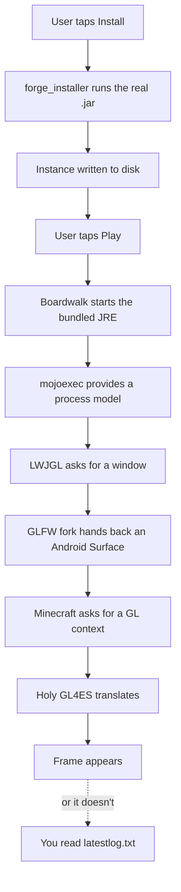

<H1 align="center">MojoLauncher (a.k.a. MJLauncher)</H1>

> **A Minecraft: Java Edition launcher for Android.** Not a port. Not an emulator. A launcher — which is a much more load-bearing word than most people give it credit for.

<a href="./README_RU.md">Readme на русском</a>


[](https://github.com/MojoLauncher/MojoLauncher/actions)
[](https://github.com/MojoLauncher/MojoLauncher/actions)
[](https://discord.gg/VHdwQFsaGX)

---

## Navigation

- [TL;DR](#tldr)
- [Introduction](#introduction)
- [The one thing that makes this hard](#the-one-thing-that-makes-this-hard)
- [The stack](#the-stack)
- [Distribution](#distribution)
- [Building](#building)
- [Current roadmap](#current-roadmap)
- [Known issues](#known-issues)
- [License](#license)
- [Contributing](#contributing)
- [Credits & third party components](#credits--third-party-components)

---

## TL;DR

MojoLauncher is a fork of [PojavLauncher](https://github.com/PojavLauncherTeam/PojavLauncher) that does exactly one thing: it takes a desktop JVM game, an Android device, and a set of constraints that would make most projects quit, and it makes them all agree with each other.

```yaml
project:
  name: MojoLauncher
  aka: MJLauncher
  lineage: PojavLauncher            # not a rewrite, a fork
  platform: Android
  target: Minecraft: Java Edition
  version_range: "rd-132211 → 26.x snapshots"
  includes: [Combat Test versions]
  modloaders: [Forge, Fabric, NeoForge-adjacent installer flows]
  modpack_import: [mrpack, CurseForge zip]
  license: LGPL-3.0
  self_description:
    - a launcher
    - a rendering translator
    - a JVM rehost
    - three of these at once, which is the problem
```

That's not a pitch, by the way. That's a threat inventory.

---

## Introduction

- MojoLauncher is a **Minecraft: Java Edition launcher for Android**, based on [PojavLauncher](https://github.com/PojavLauncherTeam/PojavLauncher).
- It launches **almost all available Minecraft versions**, from `rd-132211` through 26.x snapshots, Combat Test builds included.
- Modding works. Forge and Fabric are both supported, and installation goes through **`.jar` installers** — not a bespoke pipeline, not a sideloader, not a second-class path. The real installer runs, on device.

And yes — OptiFine works. That's not an accident; that's a consequence of the architecture holding up under load.

---

## The one thing that makes this hard

Here's the thing. Minecraft: Java Edition does not have a mobile build. Not a stripped one, not a hidden one, not a "we're not telling you" one. The Android port that everyone knows about is a native rewrite, and the Android port that *this project* is has to be something else entirely.

Which is to say: the load-bearing problem is not "run a JAR." The load-bearing problem is that Minecraft ships **two** mutually-hostile assumptions, and on Android both of them surface at once.

```text
┌────────────────────────────────────────────────────────────────────┐
│  ASSUMPTION A (from LWJGL/GLFW)                                    │
│  "There is a desktop OpenGL context, and it is well-behaved."      │
│                                                                    │
│  ASSUMPTION B (from the JVM + AWT)                                 │
│  "There is a process I can fork, and I own its file descriptors."   │
└────────────────────────────────────────────────────────────────────┘
                    │
                    ▼
        both are false on Android
                    │
                    ▼
        ┌───────────────────────────────────┐
        │  THIS IS WHERE THE WORK LIVES     │
        │  • render backend translation     │
        │  • window/event surface emulation  │
        │  • JNI-based process rehosting    │
        │  • bundled JRE (8u, multiarch)    │
        └───────────────────────────────────┘
```

The translation layer is where [Holy GL4ES](https://github.com/artdeell/gl4es_extra_extra) earns its keep, and the rehosting layer is where [mojoexec](https://github.com/MojoLauncher/mojoexec) and the LWJGL/GLFW/SDL forks do their quiet, unglamorous, load-bearing work. Nobody writes blog posts about any of it. It just has to be correct, or it's a black screen.

**The smoking gun**, if you want one: Minecraft needs `GLX`. Android has `EGL`. They are not friends. Every problem you will ever hear reported about "MojoLauncher is slow" or "textures look wrong" traces back, more often than not, to that single impedance mismatch.

---

## The stack

Not an exhaustive inventory. More of a "which piece is load-bearing for what" map.

| Layer | Component | What it actually does | If it breaks, you see |
| --- | --- | --- | --- |
| UI shell | `app_pojavlauncher` (Android app) | Accounts, instances, modpack import, version selection | The app, before Minecraft even starts |
| Game loop / process rehosting | [mojoexec](https://github.com/MojoLauncher/mojoexec) | Gives the JVM a believable process model on a platform that has no `fork()` | Nothing. It just dies. Silently. |
| Windowing | [GLFW](https://github.com/MojoLauncher/glfw) · [MojoSDL](https://github.com/MojoLauncher/MojoSDL) · [LWJGL2-GLFW](https://github.com/MojoLauncher/lwjgl2-glfw) | Translates a desktop window/event model onto an Android `Surface` | Input dies, or the screen goes black |
| Graphics | [Holy GL4ES](https://github.com/artdeell/gl4es_extra_extra) · [Mesa 3D](https://gitlab.freedesktop.org/mesa/mesa) | Translates GL calls into something the GPU will accept | Stretched textures, framebuffer weirdness |
| Runtime | [OpenJDK 8u multiarch](https://github.com/PojavLauncherTeam/openjdk-multiarch-jdk8u) | An actual JVM, built for ARM, that can boot an actual Minecraft | Nothing runs at all |
| JVM launch | [Boardwalk](https://github.com/zhuowei/Boardwalk) | Launches the JVM in-process | Silent failure on modern versions |
| JVM installer | `forge_installer` | Runs the real `.jar` installers, on device | No Forge, no Fabric, no OptiFine |
| Security | [pro-grade](https://github.com/pro-grade/pro-grade) | Sandboxes the JVM via a `SecurityManager` | The sandbox is the thing that breaks |
| Audio | [alsoft](https://github.com/kcat/openal-soft/) · [oboe](https://github.com/google/oboe) | Output path for OpenAL | Silence |
| Exit-code fidelity | [bhook](https://github.com/bytedance/bhook) | Traps exit codes so crashes report like crashes | Exit code is always `0`, debugging is impossible |
| Auth | [Authlib-Injector](https://github.com/yushijinhun/authlib-injector) | Third-party auth (ely.by and friends) | Logins fail on non-Mojang accounts |

That last column is the one people underrate. When something breaks here, it doesn't announce itself politely. It just quietly doesn't boot, and you go read a log.



---

## Distribution

Four ways in. That's not redundancy, that's coverage.

| # | Channel | Who it's for | Stability | Link |
| --- | --- | --- | --- | --- |
| 1 | **Releases** | Normal humans | Stable, signed, boring | [releases](http://github.com/mojolauncher/mojolauncher/releases) |
| 2 | **Google Play** | Normal humans who don't want to sideload | Stable, auto-updating | [](https://play.google.com/store/apps/details?id=git.artdeell.mjlaunch) |
| 3 | **GitHub Actions** | The brave | Gated behind CI, may be broken at any moment, definitely not supported | [actions](http://github.com/mojolauncher/mojolauncher/actions) |
| 4 | **Build from source** | Contributors and the curious | You own your own problems now | [see below](#building) |

If you're about to file a bug against channel #3, that's fine, but know that you're reporting against a commit nobody promised anything about.

---

## Building

The launcher builds itself. Dependencies download on the way in; that's the intended behavior, not a warning sign.

```bash
./gradlew :app_pojavlauncher:assembleDebug
```

On Windows:

```bat
.\gradlew.bat :app_pojavlauncher:assembleDebug
```

### Toolchain

```yaml
toolchain:
  jdk: 17+            # what CI uses; newer works
  gradle: 8.14.3      # pinned by the wrapper
  android_gradle_plugin: 8.11.1
  compile_sdk: 36
  min_sdk: 21
  target_sdk: 36
  namespace: git.artdeell.mojo
  root_project_name: PojavLauncher   # yes, really — it's a fork
  ndk_version: 29.0.14206865          # pinned; the native side is load-bearing
  gradle_daemon_heap: 4G
```

The `rootProject.name` being `PojavLauncher` is intentional. It's a fork, the Gradle root still carries the upstream name, and this trips up roughly one contributor per week.

### Modules

```text
:app_pojavlauncher      ← the app
:forge_installer        ← runs .jar installers on-device
:glfw:jni_bindings      ← native windowing
:mojoexec:jni_bindings  ← process rehosting
:sdl:jni_bindings       ← native windowing (SDL path)
```

### Gotchas, since you'll hit them

- **Git submodules are load-bearing.** Clone with `--recursive`, or the native build quietly produces nothing.
- **The daemon wants 4G.** `org.gradle.jvmargs` is already set. Don't lower it; the CMake/NDK portion of the build will OOM and you'll misread it as an NDK bug.
- **`configureondemand=true` is load-bearing too.** Some plugins want Java 11+ while the bundled JRE build wants Java 8. Don't "clean this up."
- **No `CURSEFORGE_API_KEY`?** The build doesn't fail. It logs a warning, stubs the key, and disables the CurseForge API. That's a feature, not a crash.

---

## Current roadmap

| Status | Item |
| --- | --- |
| ✅ Done | Instance system in favor of profiles |
| ✅ Done | Out-of-the-box 1.21.5 support |
| ✅ Done | mrpack / CurseForge zip import |
| ⬜ Open | LTW: resolve issues with Create |
| ⬜ Open | LTW: enable compute shader / image extensions |
| ⬜ Open | LTW: switch to a color-renderable format for framebuffers |
| ⬜ Open | Modpack / mod management tool |
| ⬜ Open | MMC-compatible instance import |
| ⬜ Open | Implement a common native library standard |

The three LTW items are all the same bug wearing three hats: **LWGL thread**. It's a specific thread with specific rules, and anything touching framebuffers or compute has to respect them. Expect these to move together, not independently.

The common native library standard is the quiet one, and it's the most load-bearing item on this list. Right now, every native component carries its own build output. Unifying that removes an entire class of "works on my device" problems, and that class of problem is this project's entire reputation.

---

## Known issues

| Symptom | Likely cause | Gated behind |
| --- | --- | --- |
| Physical mice feel very slow | Input path; GameActivity's mouse speed handling | A fix, currently |
| Large texture atlases look stretched/blocky (especially in modpacks) | Holy GL4ES atlas handling | The `sdl` fork, mostly |
| Something else entirely | The bug tracker | Your patience |

The third row is the honest one. This is a launcher for a game that was never designed to run on a phone, and the long tail of weirdness is not a rounding error — it's the product. There's a bug tracker for it. That's not an excuse, but it is the map.

---

## License

- MojoLauncher is licensed under **[GNU LGPLv3](https://github.com/MojoLauncher/MojoLauncher/blob/v3_openjdk/LICENSE)**.

Not MIT, not Apache, not "do what you want." LGPL-3.0 means you can use it, you can modify it, and if you ship it you have obligations. That is a deliberate choice inherited from PojavLauncher, and it is load-bearing for the project's character.

---

## Contributing

Contributions are welcome. And that's not a figure of speech — code is genuinely not the only useful contribution.

| Contribution type | Where | Why it helps |
| --- | --- | --- |
| Code | Pull requests | The obvious one |
| Wiki | [the wiki](https://github.com/MojoLauncher/MojoLauncher/wiki) | Most questions are answered once, then answered again, then again |
| Translations | [Crowdin](https://crowdin.com/project/pojavlauncher) | The launcher is used by people who don't read English |
| Bug reports | Issue tracker, with a log | The gold standard. A `latestlog.txt` turns a week of guessing into ten minutes |
| Reproductions | Issue tracker | Even a "it also happens on my X" comment is load-bearing data |

### PR shape

- Every code change goes in as a **pull request**. Direct pushes don't exist here.
- The description should explain **what the code does** and give **steps to reproduce or execute** it.

```yaml
good_pull_request:
  title: describes the change, not the commit hash
  description:
    - what: what does this do
    - why: what problem does that solve
    - steps: how do I exercise it
  scope: one concern
  tested_on:
    - device
    - android_version
    - minecraft_version
  screenshots: required for anything visual
```

Unsolicited refactors, unrelated formatting passes, and drive-by dependency bumps are not rejected on principle — they're just ungated in the wrong direction, and they make the diff unreadable. Keep the diff readable. That's the whole review.

---

## Credits & third party components

MojoLauncher stands on a very large pile of other people's work. That's not a disclaimer; it's the load-bearing structure of the project.

| Component | Role | License |
| --- | --- | --- |
| [PojavLauncher](https://github.com/PojavLauncherTeam/PojavLauncher) | Upstream project. The base. The reason any of this exists. | [GNU LGPLv3](https://github.com/PojavLauncherTeam/PojavLauncher/blob/v3_openjdk/LICENSE) |
| [Boardwalk](https://github.com/zhuowei/Boardwalk) | JVM launcher | Unknown / [Apache 2.0](https://github.com/zhuowei/Boardwalk/blob/master/LICENSE) / GPLv2 |
| Android Support Libraries | Platform glue | [Apache 2.0](https://android.googlesource.com/platform/prebuilts/maven_repo/android/+/master/NOTICE.txt) |
| [Holy GL4ES](https://github.com/artdeell/gl4es_extra_extra) | GL → GLES translation | [MIT](https://github.com/ptitSeb/gl4es/blob/master/LICENSE) |
| [OpenJDK (multiarch 8u)](https://github.com/PojavLauncherTeam/openjdk-multiarch-jdk8u) | The JVM | [GNU GPLv2](https://openjdk.java.net/legal/gplv2+ce.html) |
| [GLFW](https://github.com/MojoLauncher/glfw) | Windowing | [zlib](https://github.com/MojoLauncher/glfw/blob/glfw34/LICENSE.md) |
| [MojoSDL](https://github.com/MojoLauncher/MojoSDL) | Windowing (SDL path) | [zlib](https://github.com/MojoLauncher/MojoSDL/blob/main/LICENSE.txt) |
| [LWJGL2-GLFW](https://github.com/MojoLauncher/lwjgl2-glfw) | LWJGL bindings | 3-Clause BSD |
| [LWJGL3](https://github.com/LWJGL/lwjgl3) | LWJGL 3 | [BSD-3](https://github.com/LWJGL/lwjgl3/blob/master/LICENSE.md) |
| [mojoexec](https://github.com/MojoLauncher/mojoexec) | Process rehosting | [MIT](https://github.com/MojoLauncher/mojoexec/blob/master/LICENSE) |
| [Mesa 3D](https://gitlab.freedesktop.org/mesa/mesa) | Graphics library | [MIT](https://docs.mesa3d.org/license.html) |
| [pro-grade](https://github.com/pro-grade/pro-grade) | Java sandboxing (`SecurityManager`) | [Apache 2.0](https://github.com/pro-grade/pro-grade/blob/master/LICENSE.txt) |
| [bhook](https://github.com/bytedance/bhook) | Exit-code trapping | [MIT](https://github.com/bytedance/bhook/blob/main/LICENSE) |
| [Authlib-Injector](https://github.com/yushijinhun/authlib-injector) | Auth via ely.by and similar | [AGPL-3.0](https://github.com/yushijinhun/authlib-injector/blob/develop/LICENSE) |
| [alsoft](https://github.com/kcat/openal-soft/) | Audio output | [LGPL](https://github.com/kcat/openal-soft/blob/master/COPYING) + [modified PFFFT](https://github.com/kcat/openal-soft/blob/master/LICENSE-pffft) |
| [oboe](https://github.com/google/oboe) | Audio output | [Apache 2.0](https://github.com/google/oboe/blob/main/LICENSE) |

And a genuine thank-you to [Mineskin](https://mineskin.eu/) for providing Minecraft avatars.

---

<div align="center">

*That's not a README. It's a map of a machine nobody fully understands yet.*

</div>
